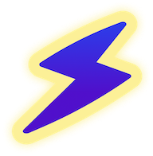

# NostrChat



NoStates is built on Nostr, and therefore doesn't rely on any centralized servers, just Nostr relays. Everyday users of NoStates can immediately benefit from Nostr’s decentralized network. This project is strongly based from [NostrChat](https://www.nostrchat.io/).


[Join NoStates](https://www.nostates.com)

## What is Nostr?

[Nostr](https://github.com/nostr-protocol/nostr) is a simple open protocol for creating censorship-resistant global networks.


## How to run NoStates locally 

Install dependencies
```bash
$ yarn 
```

Start 
```bash
$ yarn start
```

NoStates will open in your browser.

## Roadmap 🛣️

- TBC